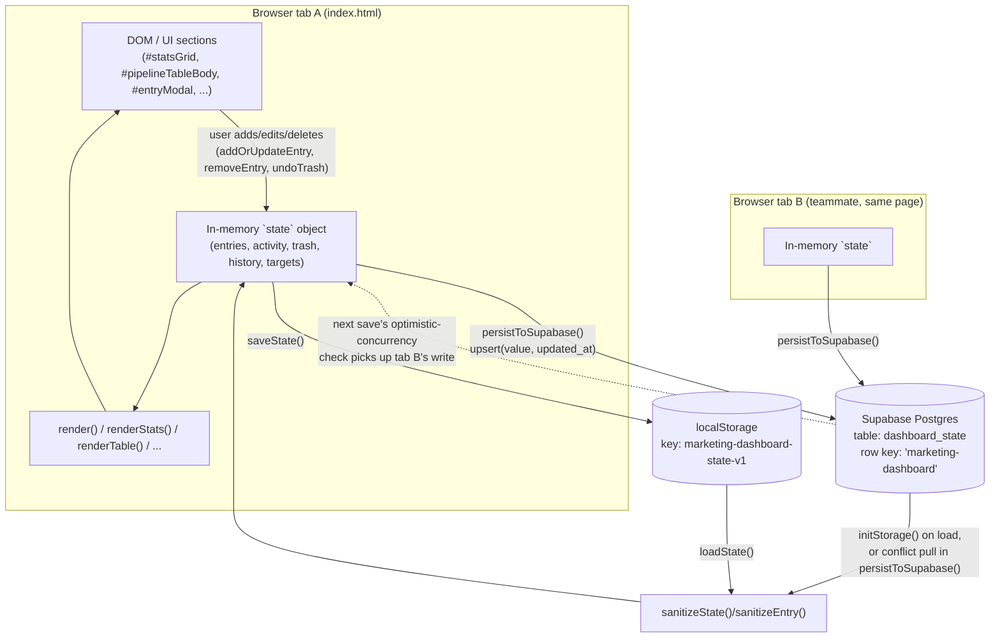

# Architecture

## Why this document exists

`index.html` has no folders, modules, or services to browse, so the usual "here's the directory layout" architecture doc doesn't apply — see [TREEVIEW.md](TREEVIEW.md) for that level of detail instead. What *is* non-trivial here is the **data-flow and consistency model**: a single client-side file that persists to two places (`localStorage` and an optional shared Supabase table) and has to stay correct when multiple people edit it at the same time with no server-side coordination. This document covers that.

## System diagram

## Data flow, step by step

1. **Page load** (`initStorage()`, `index.html:293-314`): `loadState()` reads `localStorage` first, so the page always has something to render even offline. If `window.MARKETING_DASHBOARD_CONFIG` has a Supabase URL/anon key and the CDN client loaded, the app then fetches the shared row from `dashboard_state` and — if present — replaces local state with it. Every value coming from either source is passed through `sanitizeState()`/`sanitizeEntry()` before it touches the DOM.
2. **User mutation** (`addOrUpdateEntry`, `removeEntry`, `undoTrash`, target `change` handlers, `index.html:458-514`): the only places `state` is written. Each ends by calling `saveState()`.
3. **Save** (`saveState()`, `index.html:351-356`): archives the previous month's history if the calendar month rolled over, writes the full `state` object to `localStorage` synchronously, re-renders, then — if Supabase is configured — awaits `persistToSupabase()`.
4. **Sync + conflict check** (`persistToSupabase()`, `index.html:318-349`): before writing, it re-reads the row's `updated_at` and compares it to the last value this tab observed (`lastKnownRemoteUpdatedAt`). If a teammate's tab wrote more recently, this tab **discards its own pending write**, pulls the newer remote state, re-renders, and shows a toast asking the user to redo their edit — rather than silently clobbering someone else's change. Otherwise it `upsert`s the whole state blob back to the single shared row.
5. **Failure path**: any Supabase error (network, RLS, etc.) is caught, logged via `console.warn`, and reflected in the `#syncStatus` banner (`updateSyncBanner()`). The app never permanently disables sync — every subsequent `saveState()` retries from scratch.

## Key design decisions

- **Whole-document overwrite, not field-level merge.** Every save writes the *entire* serialized `state` object to one Supabase row. There's no CRDT or per-entry diffing — the optimistic-concurrency check (comparing `updated_at`) only prevents a stale full-state write from clobbering a newer one; it does not merge two people's simultaneous edits to different entries. This is an accepted tradeoff for a small team making infrequent edits, not a general multi-writer database.
- **`localStorage` is the source of truth for availability; Supabase is additive.** The app always renders from local state first and never blocks on the network. Supabase presence/absence/failure only changes whether state is *also* shared — it never makes the page non-functional.
- **Client-side trust boundary.** The Supabase anon key is public (it ships in the HTML — see [TECHSTACK.md](TECHSTACK.md#backend--services)). Because anyone with the link (or the key) can write to the row, all state loaded from Supabase or `localStorage` is treated as untrusted and passed through `sanitizeState`/`sanitizeEntry`, and all user-supplied strings are escaped (`escapeHtml`) before being interpolated into rendered HTML. There is no auth layer — access control, if any, lives entirely in Supabase Row Level Security policy configuration, which is not part of this file.
- **No build step, no framework.** Every layer (markup, styles, state, rendering, sync) is one `<script>`/`<style>` block in `index.html`. See [TECHSTACK.md](TECHSTACK.md) for the full rationale; the practical consequence for this document is that there is no client/server boundary in the traditional sense — "frontend" and "backend" here just mean "this file" and "the Supabase table it talks to."

## What this app is *not*

- **Not a REST API service.** There is no server this app exposes; Supabase is consumed purely as a hosted JSON key-value store via the `@supabase/supabase-js` client, using exactly two query shapes (`select ... eq('key', ...).maybeSingle()` and `upsert(...)`). There are no custom routes/controllers to document, which is why this project does not have an `API.md`.
- **Not a component-based frontend.** There's no component tree with props/inputs — just top-level, singular DOM sections directly manipulated by dedicated `render*()` functions. The full inventory of those sections already lives in [TREEVIEW.md](TREEVIEW.md#body--ui-sections-the-blocks), so a separate `COMPONENTS.md` would only duplicate it.
