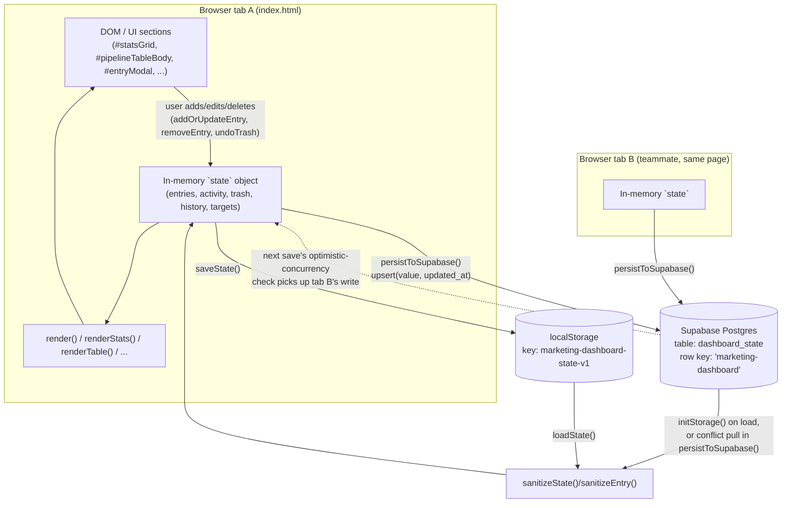

# Marketing Dashboard — Full Documentation Archive

Consolidated snapshot of all generated documentation for this project, combined into one plain-Markdown file for safekeeping/portability. Source files (`README.md`, `TECHSTACK.md`, `CHANGELOG.md`, `TREEVIEW.md`, `ARCHITECTURE.md`, `CONTRIBUTING.md`) remain the maintained originals — this file is a point-in-time copy of all six, generated by the Documentation Agent.

---

## Table of Contents

1. [README](#1-readme)
2. [TECHSTACK](#2-techstack)
3. [CHANGELOG](#3-changelog)
4. [TREEVIEW](#4-treeview)
5. [ARCHITECTURE](#5-architecture)
6. [CONTRIBUTING](#6-contributing)

---

## 1. README

# Marketing Dashboard

A single-page sales and lead pipeline tracker built for the Dekells/GRiT sales and marketing team. It gives the team a shared, no-login dashboard for logging prospects and clients, tracking deal status and follow-up dates, watching progress against a monthly revenue and lead target, and seeing a running activity feed of who changed what. It is designed to be opened directly as a file or hosted as a static page — anyone with the link can view and edit the shared pipeline instantly.

### Key features

- **Prospect/client pipeline** — add, edit, and soft-delete entries with company, contact person, phone, email, deal value, status (Contacted / Quoted / Follow-up due / Won / Lost), notes, last-contact date, next-follow-up date, and who logged the entry.
- **Search, filter, and sort** — free-text search across company/contact/phone/email, filter by status, and sort by next follow-up date, company, status, or deal value.
- **Due-today/this-week list** — automatically surfaces entries that are overdue or due within the next 7 days, flagged visually (red for overdue, amber for due soon).
- **Monthly targets with progress bars** — editable shared revenue target (GH₵) and lead-count target, each with a live progress bar computed from the current month's actual won revenue / logged leads.
- **Stat tiles** — deals won this month, win rate, overdue count, lead target, revenue target, and open-deal count.
- **Trash with undo** — deleting an entry moves it to a trash list (last 20) instead of destroying it, with a one-click restore.
- **Activity feed** — a running, timestamped log (last 50 entries) of adds/edits/deletes/restores, attributed to whoever is logged in the entry's "Logged By" field.
- **Month-over-month history** — on first load each month, the previous month's target vs. actual (revenue and leads) is automatically archived (last 6 months kept).
- **One-click outreach links** — each pipeline row generates a pre-filled WhatsApp (`wa.me`) link and a `mailto:` link addressed to that contact.
- **Optional live shared sync** — if a Supabase project is configured, all state syncs to a shared `dashboard_state` table so multiple people see the same live data; otherwise it falls back to per-browser `localStorage`.

### Tech stack

This is a single self-contained HTML file — vanilla JavaScript, inline CSS, no framework, and no build step. The only external dependency is the Supabase JS client, loaded from a CDN `<script>` tag, used purely as an optional real-time-ish persistence backend. See [TECHSTACK](#2-techstack) below for full details.

### Setup / run instructions

There is no build step and no package manager involved.

- **Just open it**: double-click `index.html` or open it in a browser (`File > Open`). It works standalone with `localStorage` only.
- **To enable shared live sync**: point the `window.MARKETING_DASHBOARD_CONFIG` object near the top of the `<script>` block in `index.html` at your own Supabase project's URL and anon key, and create a `dashboard_state` table with `key` (text, primary/unique), `value` (jsonb), and `updated_at` (timestamptz) columns. The file currently ships with a project already wired in for the team's shared use.
- **To host it**: upload `index.html` to any static host (GitHub Pages, Netlify, S3, etc.) — no server-side code is required.

There are no npm scripts, no tests, and no CI configuration in this project.

### Project structure

The project is a single file: `index.html`. There is no folder hierarchy of components, hooks, or services — everything (markup, styles, state, rendering, and Supabase sync) lives in that one file. See [TREEVIEW](#4-treeview) for an annotated breakdown of its internal sections, [TECHSTACK](#2-techstack) for the technical detail, and [ARCHITECTURE](#5-architecture) for how data flows between the page, `localStorage`, and Supabase (including the multi-editor conflict handling).

This project does not have an `API.md` (no backend routes are exposed — Supabase is used purely as a key-value store), a `COMPONENTS.md` (no component framework; see the section table in TREEVIEW instead), or an `.env.example` (no environment variables are read — the one piece of config is a hardcoded object in `index.html`, see below).

### Data and persistence

- **Primary store**: browser `localStorage` under the key `marketing-dashboard-state-v1`, holding the entire app state (targets, entries, activity feed, trash, and history) as JSON.
- **Optional shared store**: if `window.MARKETING_DASHBOARD_CONFIG` has a Supabase URL and anon key, the same state JSON is also read from and written to a single row (`key = 'marketing-dashboard'`) in the `dashboard_state` table on load and after every change, so multiple people editing the page see a shared, converging state.
- All data loaded from either source is passed through a sanitizer (`sanitizeState`/`sanitizeEntry`) before use, so malformed or unexpected JSON (from a corrupted local copy, or a write via the public anon key) can't crash the page.

### Contributing

There's no separate build/lint/test tooling to run — see [CONTRIBUTING](#6-contributing) for local setup, the manual test checklist used in place of an automated suite, and the PR process.

### License

No license file is currently present in this repository.

---

## 2. TECHSTACK

# Tech Stack

### Runtime / language

Plain JavaScript (ES2020+ syntax: optional chaining, `structuredClone`, `crypto.randomUUID`) running directly in the browser. No TypeScript, no transpilation, no bundler. HTML5 and CSS3, both authored inline inside `index.html`.

### Framework / build tooling

None. This is a single self-contained HTML file with a `<style>` block and a `<script>` block — there is no `package.json`, no lockfile, no bundler config (Vite/Webpack/etc.), no `tsconfig.json`, and no dev server required. The file is meant to be opened directly or served as a static asset. This is a deliberate architectural choice for a small internal tool: zero install friction for non-technical users sharing a single link.

### Key libraries

- **`@supabase/supabase-js@2`** — loaded from the jsDelivr CDN (`https://cdn.jsdelivr.net/npm/@supabase/supabase-js@2`). Used exclusively as an optional persistence/sync layer: creating a client with `window.supabase.createClient(...)`, and reading/writing a single row in the `dashboard_state` table. No other Supabase features (auth, storage, realtime channels) are used — `auth: { persistSession: false }` is explicitly set since the app has no login.

No other third-party JS libraries, CSS frameworks, icon sets, or fonts are used — fonts fall back to the system stack (`Arial, Helvetica, sans-serif`).

### Styling approach

Hand-written CSS inside a single `<style>` block, using:
- CSS custom properties (`:root { --navy, --blue, --danger, --card, ... }`) for a consistent dark navy/blue color palette (background gradient, card surfaces, status colors).
- Flexbox and CSS Grid for layout (`.grid`, `.layout`, `.target-row`, `.toolbar`, `.form-grid`), with a single responsive breakpoint at `max-width: 980px` that collapses multi-column grids to one column and hides two table columns on small screens.
- Utility-ish reusable classes rather than a framework (`.card`, `.pill`, `.status-badge`, `.subtle`, `.small`) — no Tailwind, no CSS Modules, no CSS-in-JS.
- A handful of inline `style="..."` attributes directly in the HTML for one-off elements (e.g. the sync status banner, target inputs).

### State management pattern

A single mutable module-level object, `state`, holds the entire application state (`revenueTarget`, `leadTarget`, `entries[]`, `activity[]`, `trash[]`, `history[]`). There is no reactive framework or virtual DOM:
- All mutations are plain JS (`state.entries.unshift(...)`, `state.entries = state.entries.filter(...)`, etc.) performed directly inside event handler functions.
- After any mutation, `saveState()` is called, which persists to `localStorage`, optionally pushes to Supabase, and calls `render()`.
- `render()` is a full manual re-render: it re-reads `state` and rewrites the innerHTML of each section (`renderStats`, `renderProgress`, `renderDueList`, `renderTrash`, `renderActivity`, `renderHistory`, `renderTable`) — there is no diffing; each render call fully regenerates that section's markup and re-binds its event listeners (e.g. edit/delete buttons in the pipeline table, undo buttons in trash).
- A small set of transient UI-only variables (`filterText`, `filterStatus`, `sortField`) live outside `state` and are not persisted — they only affect what `renderTable()` displays.
- `structuredClone` is used to produce independent copies of `DEFAULT_STATE` so the constant template is never mutated in place.

### Backend / services

There is no custom backend/API server. The only backend is Supabase (a hosted Postgres + REST/Realtime service), used purely as a key-value document store:

- **Table**: `dashboard_state`, with (inferred from the queries) at least `key` (text), `value` (jsonb — the entire serialized `state` object), and `updated_at` (timestamptz).
- **Read**: on load, `select('value, updated_at').eq('key', 'marketing-dashboard').maybeSingle()` fetches the shared row; if present, it replaces local state (after sanitization).
- **Write**: `upsert(payload, { onConflict: 'key' })` writes `{ key: 'marketing-dashboard', value: state, updated_at }` after every local state change (via `persistToSupabase()`), so the shared row always reflects the last writer's full state.
- **Concurrency handling**: before writing, the app re-checks the row's current `updated_at` against the last value it saw (`lastKnownRemoteUpdatedAt`). If someone else has written in the meantime, the local page discards its pending write, pulls their newer state instead, re-renders, and shows a toast telling the user to redo their edit — a simple optimistic-concurrency guard against silently clobbering a concurrent editor.
- **Failure handling**: sync failures (network issues, RLS/permission errors, etc.) are caught, logged to `console.warn`, and surfaced via a persistent on-page banner (`#syncStatus`) reading "Sync issue — your changes are saved locally and will retry automatically on the next edit." The app never gives up on syncing permanently — every `saveState()` call retries.
- **Configuration**: the Supabase project URL and anon key are set inline in `window.MARKETING_DASHBOARD_CONFIG` at the top of the script. Because this is a public anon key embedded in client-side HTML, the app treats all remote data as untrusted input and sanitizes it (see below) before ever rendering or storing it.

### Data validation / sanitization

- `sanitizeEntry(raw)` and `sanitizeState(raw)` coerce and validate every field of incoming JSON (from `localStorage` or Supabase) to expected types, rejecting entries missing a `company`/`contactPerson`, clamping deal values to non-negative finite numbers, restricting `status` to the known `VALID_STATUSES` list, capping `activity` to 50 items and `trash` to 20 items, and generating a fresh UUID for any missing/invalid `id`. This guards against a corrupted local copy or a malicious/malformed write via the public anon key from ever crashing rendering or injecting unexpected shapes.
- `escapeHtml(value)` is applied to all user-supplied strings before they're interpolated into template-literal HTML (table cells, due-list items, trash items, activity feed), preventing stored/reflected XSS since deal/contact data can be entered by anyone with the link.

### Linting / testing

None present — no ESLint/Prettier config, no test runner, no CI workflow files.

### Notable architectural decisions

- **Single self-contained HTML file, no build step** — chosen for a small internal tool that needs to be trivially shareable and editable without tooling.
- **`localStorage`-first with best-effort Supabase sync** — the app always works offline/standalone; Supabase is strictly additive and its absence or failure degrades gracefully to local-only persistence.
- **Optimistic concurrency via `updated_at` comparison** rather than realtime subscriptions or CRDT merging — simple, good enough for a small team's low-frequency edits, at the cost of a coarse "last full write wins, unless someone else wrote more recently" model (the whole state blob is overwritten each save, not merged field-by-field).
- **Full manual re-render per state change** rather than a virtual DOM/reactive framework — appropriate given the app's modest UI complexity and the goal of zero dependencies.
- **Soft delete + capped trash/activity/history arrays** — deliberate bounded-memory design (trash capped at 20, activity at 50, history at 6 months) so the state document doesn't grow unbounded in `localStorage`/Postgres over time.

---

## 3. CHANGELOG

# Changelog

All notable changes to this project are documented in this file, in the [Keep a Changelog](https://keepachangelog.com/) format.

This project has a single file (`index.html`) and a small git history: one commit, `44cc131` ("Initial marketing dashboard", 2026-07-23). The working copy currently contains additional uncommitted changes (a fix pass) on top of that commit; those are listed under **[Unreleased]** below. Entries are derived from the actual commit and from a diff of the working tree against it — nothing here is fabricated.

### [Unreleased]

Uncommitted changes currently in the working copy, not yet part of a git commit.

#### Added
- Sync status banner (`#syncStatus`) that appears when a Supabase write or read fails, telling the user their changes are saved locally and will retry automatically.
- Input sanitization layer (`sanitizeEntry`, `sanitizeState`, `VALID_STATUSES`) applied to any state loaded from `localStorage` or Supabase, so corrupted or unexpected data can no longer crash rendering or smuggle in invalid fields.
- HTML-escaping (`escapeHtml`) applied to all user-entered values before they're rendered (pipeline table, due list, trash list, activity feed), closing an XSS gap where a company name, contact name, or note containing HTML/script content would previously be rendered unescaped.
- Optimistic-concurrency check before every Supabase write: the app compares the row's live `updated_at` against the last value it fetched, and if another editor has written since, it discards the pending local write, pulls their newer state, re-renders, and shows a toast asking the user to redo their edit — instead of silently overwriting a concurrent change.
- `wonAt` timestamp is now set/preserved explicitly when an entry's status changes to "won" (and cleared if it's changed away from "won"), instead of being inferred from `updatedAt`.

#### Changed
- Trash capacity raised from 5 to 20 retained entries before the oldest is permanently purged.
- Deal-value validation on the entry form now rejects negative or non-finite values (previously only rejected falsy/zero values, which incorrectly blocked a legitimate `0` deal value in some cases while allowing negative numbers through).
- `getMonthKey()` now derives the year/month from local date parts (`getFullYear()`/`getMonth()`) instead of `toISOString().slice(0,7)`, avoiding a day/month misattribution for users near the UTC day boundary.
- Monthly revenue and "won this month" stat calculations now key off `wonAt` (falling back to `updatedAt`/`createdAt`) instead of `updatedAt`, so editing a won deal's notes later no longer shifts which month its revenue is counted in.
- Supabase sync no longer permanently disables itself after one failed request (previously a single error set a `usingSupabase = false` flag for the rest of the session); it now retries on every subsequent save via a per-attempt `try/catch`.

#### Fixed
- Restoring an entry from Trash (`undoTrash`) now strips the `deletedAt` field before re-inserting it into the active pipeline, so a restored entry is no longer mistaken for a trashed one.

### [0.1.0] - 2026-07-23

Initial commit (`44cc131`, "Initial marketing dashboard"). First working version of the dashboard.

#### Added
- Single-file HTML/CSS/JS marketing/sales pipeline dashboard with no build step.
- Prospect/client entry form (add/edit/delete) covering company, contact person, phone, email, deal value, status, notes, last-contact date, next-follow-up date, and logged-by.
- Shared pipeline table with search, status filter, and sort (by next follow-up date, company, status, or deal value).
- Stat tiles for deals won this month, win rate, overdue items, lead target, revenue target, and open deals.
- Editable monthly revenue and lead targets with progress bars.
- Due-today/this-week list with overdue/soon flagging.
- Trash with a 5-entry cap and undo.
- Activity feed logging adds/edits/deletes/restores (last 50).
- Month-over-month history archiving (last 6 months) triggered automatically on load.
- One-click WhatsApp and email outreach links generated per pipeline entry.
- `localStorage` persistence under `marketing-dashboard-state-v1`.
- Optional Supabase sync (`dashboard_state` table) via a CDN-loaded `@supabase/supabase-js` client, with graceful fallback to local-only storage if unconfigured or unreachable.

---

## 4. TREEVIEW

# Project Tree

This project is a **single self-contained HTML file** — there is no folder structure, no components directory, no services directory, and no build output to speak of. The tree below is therefore trivial at the filesystem level; the more useful "architecture map" is the annotated breakdown of `index.html`'s internal sections further down.

```
Marketing dashboard/
├── .git/              # Git repository metadata (1 commit on record); not enumerated further
├── index.html         # The entire application: markup, CSS, and JS in one file
├── README.md          # Human-facing overview (generated)
├── TECHSTACK.md       # Technical stack detail (generated)
├── CHANGELOG.md       # Version history (generated)
├── TREEVIEW.md        # This file (generated)
├── ARCHITECTURE.md    # Data-flow/consistency model between the page, localStorage, and Supabase (generated)
└── CONTRIBUTING.md    # Local setup, manual test checklist, PR process (generated)
```

No `node_modules`, lockfiles, `dist`/`build` output, or config files (`package.json`, `tsconfig.json`, bundler configs) exist in this project — consistent with it being a zero-dependency static HTML file.

Not generated for this project: `API.md` (no backend routes — Supabase is used only as a key-value store, not a REST API this app exposes), `COMPONENTS.md` (no component framework or reusable parameterized UI components — the single-purpose DOM sections are already catalogued below), and `.env.example` (the app reads no environment variables at all; its one piece of config, the Supabase URL/anon key, is a hardcoded `window.MARKETING_DASHBOARD_CONFIG` object inline in `index.html`, not sourced from `.env`/`process.env`).

### Inside `index.html` — annotated map

Since everything lives in one file, this is the real architecture map: the file's logical regions in the order they appear.

#### `<head>` / `<style>` (config, no folders)
| Region | Purpose |
|---|---|
| `:root` CSS variables | Color palette (navy/blue dark theme, status colors: danger/warning/success) shared by every rule below it |
| Layout rules (`.shell`, `.grid`, `.layout`, `.target-row`, `.toolbar`, `.form-grid`) | Grid/flex layout for the page shell and each major section |
| Component-style rules (`.card`, `.stat-card`, `.due-item`, `.trash-item`, `.status-badge`, `.pill`, `.modal`, `.toast`) | Reusable visual "components" expressed purely as CSS classes, applied to plain `<div>`/`<table>` markup |
| Responsive breakpoint (`@media max-width: 980px`) | Collapses multi-column grids to one column and hides two table columns on small screens |

#### `<body>` — UI sections (the "blocks")
| Section (element id) | Renders | Populated by |
|---|---|---|
| `.topbar` | Title, subtitle, "New Prospect" and "Refresh View" buttons | Static markup + `newEntryBtn`/`refreshBtn` listeners |
| `#syncStatus` | Warning banner shown only when a Supabase sync attempt has failed | `updateSyncBanner()` |
| `#statsGrid` | 6 stat cards: won this month, win rate, overdue items, lead target, revenue target, open deals | `renderStats()` |
| Target row (`#revenueTargetInput`/`#revenueProgress`, `#leadTargetInput`/`#leadProgress`) | Editable monthly revenue/lead targets with progress bars | `renderProgress()`; inputs write to `state` on `change` |
| `#dueList` | Entries overdue or due within 7 days, flagged `flag-overdue`/`flag-soon` | `renderDueList()` / `getDueItems()` |
| `#trashList` | Soft-deleted entries with an Undo button each | `renderTrash()` / `undoTrash()` |
| Pipeline card (`#searchInput`, `#statusFilter`, `#sortField`, `#clearFiltersBtn`, `#pipelineTableBody`) | Searchable/filterable/sortable table of all entries, with Edit/Delete/WhatsApp/Email actions per row | `renderTable()` |
| `#activityFeed` | Chronological log of the last 50 add/edit/delete/restore actions | `renderActivity()` |
| `#historyList` | Archived month-over-month target vs. actual snapshots (last 6 months) | `renderHistory()` / `archiveMonthIfNeeded()` |
| Quick Notes card | Static explanatory text (no-login, live-shared pipeline note) | Static markup |
| `#entryModal` / `#entryForm` | Add/Edit Prospect modal form (company, contact, phone, email, deal value, status, dates, logged-by, notes) | `openModal()` / `addOrUpdateEntry()` |
| `#toast` | Ephemeral bottom-right notification (e.g. "Entry saved successfully.") | `showToast()` |

#### `<script>` — data shape and logic (the "types" and "services" for a plain-JS app)

**Core state shape** (`DEFAULT_STATE`, persisted whole):
```
{
  revenueTarget: number,
  leadTarget: number,
  entries: Entry[],
  activity: ActivityItem[],
  trash: Entry[],       // soft-deleted entries, each with an added deletedAt
  history: HistoryItem[]
}
```

**`Entry` shape** (one pipeline row), enforced by `sanitizeEntry`:
```
{
  id, company, contactPerson, phone, email,
  dealValue: number (>= 0),
  status: 'contacted' | 'quoted' | 'follow-up-due' | 'won' | 'lost',
  notes, lastContactDate, nextFollowUpDate, loggedBy,
  createdAt, updatedAt,
  wonAt?: string,       // set when status transitions to 'won'
  deletedAt?: string    // present only while sitting in trash
}
```

**`ActivityItem`**: `{ id, text, createdAt }` — capped at 50, newest first.

**`HistoryItem`**: `{ monthKey, monthLabel, revenueTarget, revenueActual, leadTarget, leadActual, archivedAt }` — capped at 6, one per month, appended by `archiveMonthIfNeeded()`.

**Function groups** (no separate files — all in the one `<script>` block):
- **Persistence / sync** — `loadState`, `saveState`, `initStorage`, `persistToSupabase`, `updateSyncBanner`: read/write `localStorage`, and optionally read/write the Supabase `dashboard_state` table with an optimistic-concurrency check against `updated_at`.
- **Validation** — `sanitizeEntry`, `sanitizeState`, `escapeHtml`, `statusClass`: coerce untrusted JSON into the expected shape and escape values before they hit the DOM.
- **Derived data / calculations** — `getMonthKey`, `formatMonthLabel`, `sumWonRevenueForMonth`, `countEntriesByMonth`, `getDueItems`, `formatMoney`: pure functions computing stats, due-item flags, and currency formatting (GH₵ via `Intl.NumberFormat`) from `state`.
- **Rendering** — `render`, `renderStats`, `renderProgress`, `renderDueList`, `renderTrash`, `renderActivity`, `renderHistory`, `renderTable`: each rewrites one section's `innerHTML` from current `state` and re-binds that section's event listeners.
- **Mutations** — `addOrUpdateEntry`, `removeEntry`, `undoTrash`, plus the target-input `change` handlers: the only places `state` is mutated; each ends by calling `saveState()`.
- **Modal control** — `openModal`, `closeModal`: populate/clear the add-edit form and toggle the modal's visibility.
- **Outreach helpers** — `buildWhatsAppLink`, `buildEmailLink`: build a `wa.me` URL and a `mailto:` URL pre-filled with a follow-up message per entry.
- **Misc UI** — `showToast`: transient bottom-right toast notifications.

**External service integration**: a single `<script src="https://cdn.jsdelivr.net/npm/@supabase/supabase-js@2">` tag loads the Supabase client; `window.MARKETING_DASHBOARD_CONFIG` (defined inline, just below) supplies the project URL and anon key used by `initStorage()`/`persistToSupabase()`.

---

## 5. ARCHITECTURE

# Architecture

### Why this document exists

`index.html` has no folders, modules, or services to browse, so the usual "here's the directory layout" architecture doc doesn't apply — see TREEVIEW above for that level of detail instead. What *is* non-trivial here is the **data-flow and consistency model**: a single client-side file that persists to two places (`localStorage` and an optional shared Supabase table) and has to stay correct when multiple people edit it at the same time with no server-side coordination. This document covers that.

### System diagram



### Data flow, step by step

1. **Page load** (`initStorage()`, `index.html:293-314`): `loadState()` reads `localStorage` first, so the page always has something to render even offline. If `window.MARKETING_DASHBOARD_CONFIG` has a Supabase URL/anon key and the CDN client loaded, the app then fetches the shared row from `dashboard_state` and — if present — replaces local state with it. Every value coming from either source is passed through `sanitizeState()`/`sanitizeEntry()` before it touches the DOM.
2. **User mutation** (`addOrUpdateEntry`, `removeEntry`, `undoTrash`, target `change` handlers, `index.html:458-514`): the only places `state` is written. Each ends by calling `saveState()`.
3. **Save** (`saveState()`, `index.html:351-356`): archives the previous month's history if the calendar month rolled over, writes the full `state` object to `localStorage` synchronously, re-renders, then — if Supabase is configured — awaits `persistToSupabase()`.
4. **Sync + conflict check** (`persistToSupabase()`, `index.html:318-349`): before writing, it re-reads the row's `updated_at` and compares it to the last value this tab observed (`lastKnownRemoteUpdatedAt`). If a teammate's tab wrote more recently, this tab **discards its own pending write**, pulls the newer remote state, re-renders, and shows a toast asking the user to redo their edit — rather than silently clobbering someone else's change. Otherwise it `upsert`s the whole state blob back to the single shared row.
5. **Failure path**: any Supabase error (network, RLS, etc.) is caught, logged via `console.warn`, and reflected in the `#syncStatus` banner (`updateSyncBanner()`). The app never permanently disables sync — every subsequent `saveState()` retries from scratch.

### Key design decisions

- **Whole-document overwrite, not field-level merge.** Every save writes the *entire* serialized `state` object to one Supabase row. There's no CRDT or per-entry diffing — the optimistic-concurrency check (comparing `updated_at`) only prevents a stale full-state write from clobbering a newer one; it does not merge two people's simultaneous edits to different entries. This is an accepted tradeoff for a small team making infrequent edits, not a general multi-writer database.
- **`localStorage` is the source of truth for availability; Supabase is additive.** The app always renders from local state first and never blocks on the network. Supabase presence/absence/failure only changes whether state is *also* shared — it never makes the page non-functional.
- **Client-side trust boundary.** The Supabase anon key is public (it ships in the HTML — see TECHSTACK above). Because anyone with the link (or the key) can write to the row, all state loaded from Supabase or `localStorage` is treated as untrusted and passed through `sanitizeState`/`sanitizeEntry`, and all user-supplied strings are escaped (`escapeHtml`) before being interpolated into rendered HTML. There is no auth layer — access control, if any, lives entirely in Supabase Row Level Security policy configuration, which is not part of this file.
- **No build step, no framework.** Every layer (markup, styles, state, rendering, sync) is one `<script>`/`<style>` block in `index.html`. See TECHSTACK above for the full rationale; the practical consequence for this document is that there is no client/server boundary in the traditional sense — "frontend" and "backend" here just mean "this file" and "the Supabase table it talks to."

### What this app is *not*

- **Not a REST API service.** There is no server this app exposes; Supabase is consumed purely as a hosted JSON key-value store via the `@supabase/supabase-js` client, using exactly two query shapes (`select ... eq('key', ...).maybeSingle()` and `upsert(...)`). There are no custom routes/controllers to document, which is why this project does not have an `API.md`.
- **Not a component-based frontend.** There's no component tree with props/inputs — just top-level, singular DOM sections directly manipulated by dedicated `render*()` functions. The full inventory of those sections already lives in TREEVIEW above, so a separate `COMPONENTS.md` would only duplicate it.

---

## 6. CONTRIBUTING

# Contributing

Thanks for helping maintain the Marketing Dashboard. This is a single-file, no-build-step project, so the workflow is intentionally lightweight.

### Local setup

There is no package manager, no dependencies to install, and no build step.

1. Clone the repo: `git clone https://github.com/kekeligafatsi/marketing-dashboard.git`
2. Open `index.html` directly in a browser (double-click it, or `File > Open`), **or** serve it with any static file server if you want it on `http://localhost` instead of `file://` (for example `python -m http.server` from the project folder, then visit the printed URL). Either way works identically — the app only needs a browser that can run `localStorage` and load the Supabase CDN script.
3. If you want to test the shared-sync path against your **own** data instead of the team's live Supabase project, temporarily edit the `window.MARKETING_DASHBOARD_CONFIG` object near the top of the `<script>` block in `index.html` with your own project's URL/anon key and a `dashboard_state` table (`key` text, `value` jsonb, `updated_at` timestamptz) — see README above. Do not commit your personal credentials over the team's config.

### Making changes

- Everything lives in `index.html` — markup, CSS, and JS in one file. There's no separate components/services/styles directory to navigate.
- Keep the file dependency-free: don't introduce a bundler, framework, or additional CDN scripts unless there's a strong reason, since zero-install simplicity is a deliberate design choice (see TECHSTACK above).
- Follow the existing patterns already in the file: mutate `state`, then call `saveState()`; escape any user-supplied string with `escapeHtml()` before interpolating it into rendered HTML; validate any new persisted field in `sanitizeEntry`/`sanitizeState` so malformed local/remote data can't crash rendering.

### Testing

There is no automated test suite, linter, or CI configuration in this project — verify changes manually in a browser:

- Add, edit, and soft-delete a pipeline entry; confirm it persists after a page reload (`localStorage`).
- If Supabase is configured, confirm the sync banner (`#syncStatus`) behaves correctly — hidden on success, shown on a forced failure (e.g. temporarily point the config at an invalid URL).
- Check the responsive layout below the `980px` breakpoint (columns collapse, two table columns hide).
- Check the browser console for errors/warnings during load, save, and sync.

### Commit conventions

- This repo's history is small; there isn't an established strict commit-message format yet. When your change is user-visible, add an entry to the matching Keep a Changelog section (`Added` / `Changed` / `Fixed` / `Removed` / `Deprecated` / `Security`) under `[Unreleased]` in CHANGELOG above, the same way prior changes are documented there.
- Write commit messages that explain *why*, not just *what*, especially for anything touching the sync/concurrency logic (`persistToSupabase`, `sanitizeState`) or data shape (`DEFAULT_STATE`, `Entry`).

### Pull request process

1. Create a branch off `master` for your change.
2. Push your branch and open a PR against `kekeligafatsi/marketing-dashboard` (`gh pr create` or the GitHub UI).
3. In the PR description, note what you tested manually (there's no CI to lean on).
4. Since the whole app is one file, expect diffs to be easy to review in full — please avoid unrelated reformatting in the same PR as a functional change, to keep diffs reviewable.
